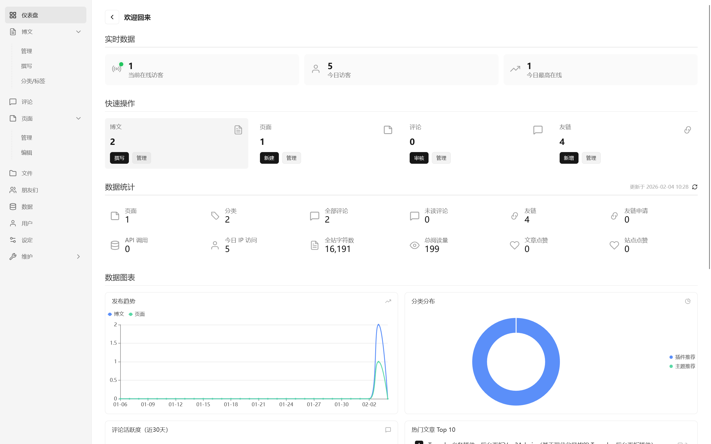
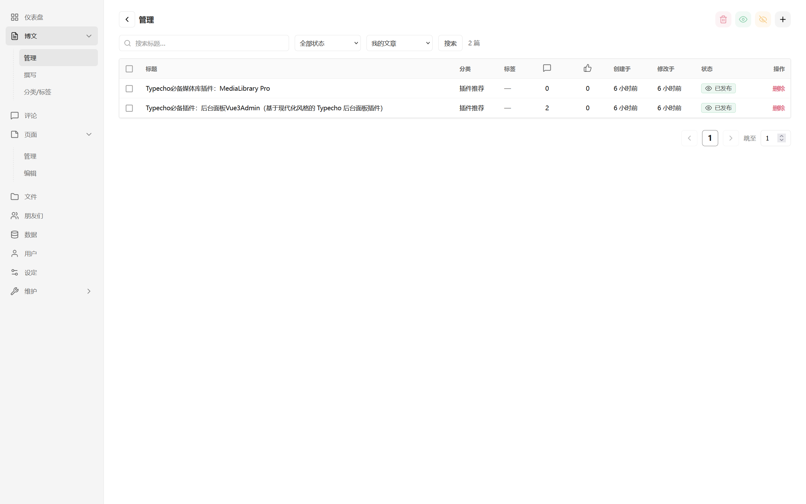
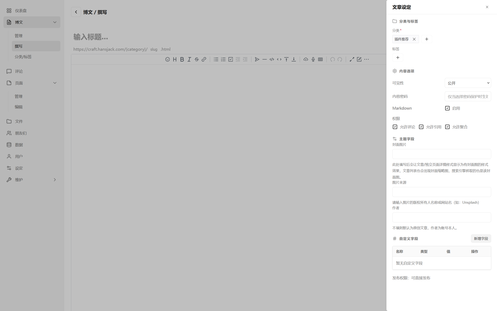
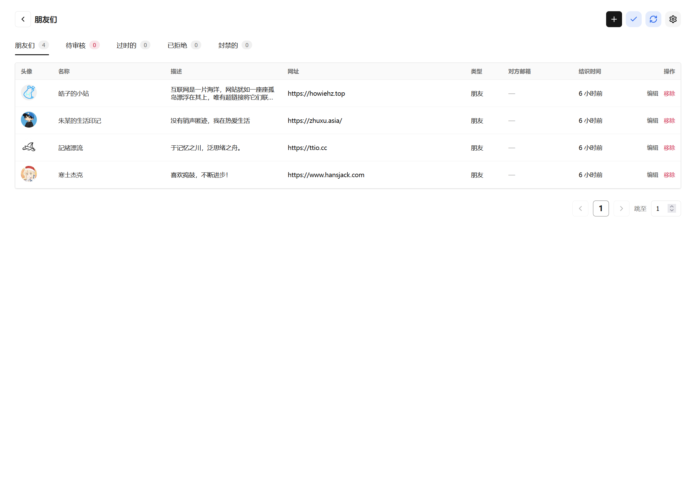
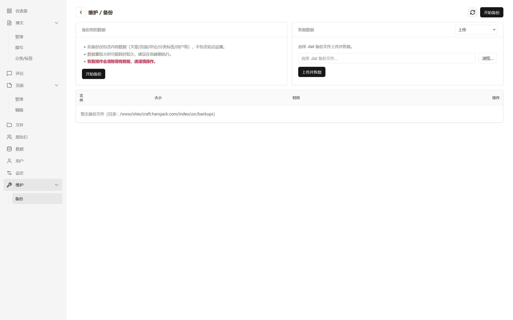
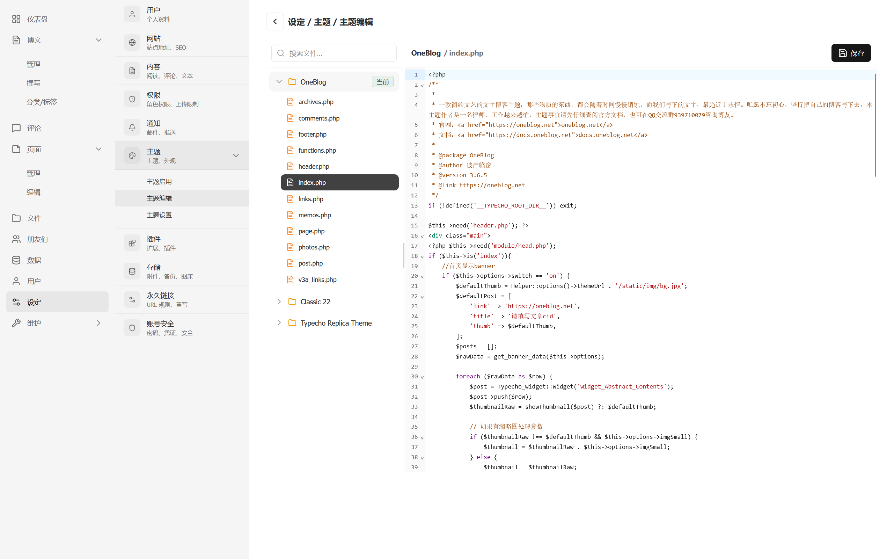

# Vue3Admin

基于现代化风格的 Typecho 后台面板插件（Vue3Admin）。

> 重要：只有当 **Release** 发布后才能使用。
>
> 当前仓库为**测试/开发版本**，功能与接口可能随时调整，请勿直接用于生产环境。

- QQ 群：`556339740`
- 赞助： [赞助我](#赞助)

## 功能概览

- 启用后接管 Typecho 后台路径：把后台切换到 `/<Vue3Admin>/`（默认：`/Vue3Admin/`）。
- 自动部署后台资源到站点根目录：`/Vue3Admin/`。
- 访问统计：前台访问会写入本地数据文件（用于仪表盘统计数据）。

## 界面预览

| 仪表盘 | 文章管理 | 文章编辑 |
| --- | --- | --- |
|  |  |  |
| 友链 | 备份还原 | 主题编辑 |
|  |  |  |

## 前台访客统计（可选：主题 footer 上报）

为了避免把后台面板请求计入统计，并兼容一些缓存/静态化场景，推荐在主题的 `footer.php`（或页面底部公共文件，建议放在 `</body>` 前）添加以下代码：

```html
<!-- Vue3Admin 访客统计：仅前台（不含后台面板） -->
<script>
(function () {
  try {
    var endpoint = "<?php echo \Typecho\Common::url('Vue3Admin/track.php', $this->options->siteUrl); ?>";
    var payload = {
      path: location.pathname + location.search,
      cid: <?php echo $this->is('post') && isset($this->cid) ? (int) $this->cid : 0; ?>,
      referrer: document.referrer || ""
    };
    var body = JSON.stringify(payload);
    if (navigator.sendBeacon) {
      navigator.sendBeacon(endpoint, new Blob([body], { type: "application/json" }));
      return;
    }
    fetch(endpoint, {
      method: "POST",
      headers: { "Content-Type": "application/json" },
      body: body,
      keepalive: true,
      credentials: "omit"
    }).catch(function () {});
  } catch (e) {}
})();
</script>
```

说明：

- 记录字段：访问 IP（服务端获取）、访问路径（`path`）、文章 ID（`cid`，仅文章页）、访问设备（由 UA 解析）、访问时间（服务端时间）。
- 上报端点：站点根目录的 `/Vue3Admin/track.php`（插件启用后会自动部署）。
- 如果站点在反代/CDN 后，想显示真实访客 IP，请确保服务器正确传递 `CF-Connecting-IP` / `X-Forwarded-For` / `X-Real-IP` 等请求头。

## 安装与启用

> 请使用 Release 页面提供的打包文件进行安装。

1. 将插件目录上传到：`usr/plugins/Vue3Admin/`。
2. 在 Typecho 后台插件管理中启用 **Vue3Admin**。

启用后插件会自动：

1. 复制插件内置的 `admin/` 到站点根目录：`/Vue3Admin/`。
2. 修改站点根目录 `config.inc.php` 内的 `__TYPECHO_ADMIN_DIR__` 为 `/Vue3Admin/`，从而“弃用”旧的 `/admin/`。

完成后请通过 `https://你的域名/Vue3Admin/` 访问新后台。

## 配置项

在插件设置中可配置：

- 主色（Primary Color）：用于面板主题色（CSS 变量）。
- Vue3 CDN：默认使用 `https://unpkg.com/`。
- ECharts CDN：默认使用 `https://cdn.jsdelivr.net/`。

如站点环境无法访问外网 CDN，请替换为自建静态资源地址。

## 数据存储（本地化）

插件数据默认存放在插件目录下的本地 SQLite 文件：`usr/plugins/Vue3Admin/cache/v3a_data.sqlite`（不会创建 Typecho 数据库表）。

- 依赖：PHP `pdo_sqlite` 扩展；导入/导出 ZIP 需要 `ZipArchive`。
- “维护 / 升级”页面底部提供：
  - 数据迁移：导出/导入插件数据（ZIP）。
  - 旧版本维护：把旧版本的数据库表数据迁移到本地，并删除旧表。

## 停用与恢复

在插件管理中停用 **Vue3Admin** 后：

- 会把 `__TYPECHO_ADMIN_DIR__` 改回 `/admin/`（恢复默认后台路径）。

可选操作（手动）：

- 删除站点根目录的 `/Vue3Admin/`。

## 注意事项（必读）

- 插件会改写 `config.inc.php`，并在首次改写时自动备份到 `config.inc.php.vue3admin.bak`。
- 请确保 PHP 进程对站点根目录与 `config.inc.php` 具备写权限，否则启用会失败。
- 如出现无法进入后台的情况，可手动把 `config.inc.php` 中的 `__TYPECHO_ADMIN_DIR__` 恢复为 `/admin/`，或用备份文件回滚。

## 交流与反馈

- QQ 群：`556339740`

## 付费增值功能（按需开通）

> 说明：以下为赞助/付费的额外模块；其中“规划中/可定制”项不一定已在当前版本实现，可按需排期实现。

已支持 / 可开通：

- 数据库工具：文章库增强（检索/统计）、系统库维护（备份/还原/优化）
- API 能力：数据统计 API、数据导出接口
- 媒体库 Pro：图片压缩、WebP/AVIF 转换、水印、批量处理

规划中 / 可定制：

- 对象存储与 CDN：S3/OSS/COS 集成、CDN 刷新
- 权限与安全：细粒度角色权限、2FA/登录保护
- 其他需求定制

价格：每个模块 6.66（按需选择）。

赞助时备注：需要的模块 + 邮箱即可（或在 `www.hansjack.com` 留言）。

## 赞助


## 许可证

本项目采用 **GNU General Public License v3.0 (GPL-3.0)** 许可证发布。  
完整条款见仓库根目录 `LICENSE` 文件。
